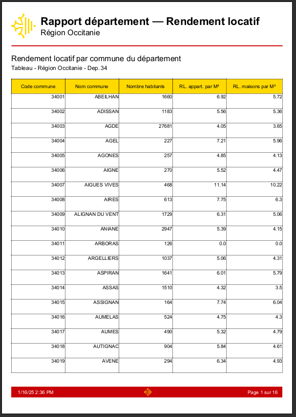
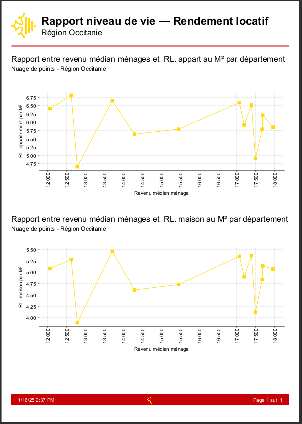
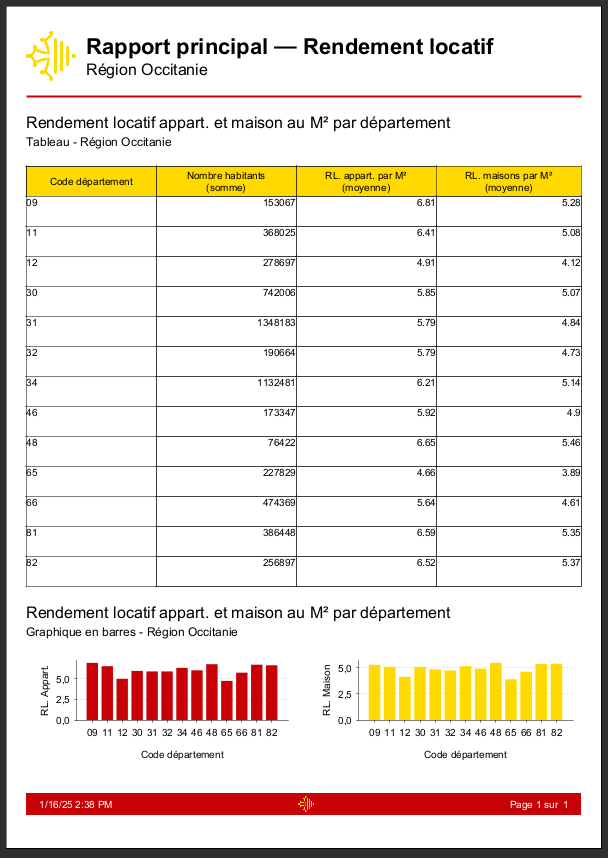

<div align="center">
  

[](https://github.com/Foufou-exe/occitanie-report-rental-yields/blob/main/LICENSE)
[]()
[]()
[]()
[]()
[]()
</div>

<div align="center">

[🇫🇷 Français](./README.fr.md) | [🇬🇧 English](./README.md)

</div>


# 📊 Projet JasperReports : Analyse des Rendements Locatifs en Occitanie

## 📌 Description

Ce projet a pour objectif de fournir une analyse détaillée et visuelle des zones à fort rendement locatif dans la région Occitanie. En utilisant **Jaspersoft Studio** pour le reporting et des technologies comme **Python** et **MySQL**, nous avons créé plusieurs rapports permettant à un investisseur immobilier d'identifier les meilleures opportunités d'investissement.

## ⚡ Fonctionnalités principales
- **Collecte de données** : Extraction de données open data (à partir de [data.gouv.fr](https://www.data.gouv.fr)) sur les loyers, les prix d'acquisition, la démographie, et les revenus des ménages.
- **Nettoyage et transformation des données** : Utilisation de **Python** (avec Pandas, Numpy et SQLAlchemy) pour nettoyer, transformer et insérer les données dans une base **MySQL**.
- **Reporting visuel** : Création de rapports esthétiques et interactifs dans Jaspersoft Studio avec des graphiques (barres, nuages de points, diagrammes circulaires).
- **Analyse avancée** :
  - Corrélation entre la démographie et les rendements locatifs.
  - Comparaison des revenus des ménages avec les rendements locatifs.

## 📁 Structure du projet

- **`/settings`** : Paramètres de configuration JasperReports.
- **`/images`** : Logos et images utilisées dans les rapports.
- **`/reports`** : Fichiers JRXML des rapports Jasper.
- **`/reports/driver`** : Pilotes JDBC pour MySQL.
- **`/reports/rendered`** : Rapports générés au format PDF.
- **`/scripts`** : Scripts Python pour le nettoyage et la transformation des données.
- **`/sources/original`** : Fichiers sources CSV/XLSX utilisés pour l'analyse et transformation.
- **`/sources/sql`** : Scripts SQL pour la création des tables et l'insertion des données.
- **`docker-compose.yml`** : Fichier de configuration Docker pour MySQL et phpMyAdmin.


## 🛠️ Technologies utilisées

### Outils de reporting :
- **Jaspersoft Studio** : Création de rapports professionnels.

### Collecte et transformation des données :
- **Python** : Pandas, Numpy, SQLAlchemy.
- **Power Query** : Profilage des données.

### Base de données :
- **MySQL** : Stockage des données nettoyées.
- **Docker** : Gestion des conteneurs pour MySQL et phpMyAdmin.


## 📊 Rapports disponibles

1. **Rapport principal** : Vue synthétique des rendements locatifs par département.
2. **Zoom sur les communes** : Analyse détaillée par commune au sein d'un département.
3. **Impact de la démographie** : Corrélation entre démographie et rendements locatifs.
4. **Rendement locatif vs revenus des ménages** : Analyse des revenus des ménages par rapport aux rendements locatifs.


## 🚀 Installation et utilisation

### Prérequis

- **Docker** et **Docker Compose** installés.
- **Jaspersoft Studio**
- **Python 3.x** avec les bibliothèques suivantes : **Pandas, Numpy, SQLAlchemy.**

### Étapes d'installation

1. Clonez ce dépôt :
   ```bash
   git clone https://github.com/Foufou-exe/occitanie-report-rental-yields.git
   ```
2. Configurez et lancez les conteneurs Docker :
   ```bash
   docker-compose up -d
   ```
3. Exécutez les scripts Python pour nettoyer et insérer les données dans MySQL :
   ```bash
   cd scripts
   python import-csv-to-sql.py
   ```
4. Lancez Jaspersoft Studio.
5. Importez les fichiers JRXML + le connecteur MySQL JDBC `DataAdapterMySQL.jrdax` depuis **`/reports`**.
6. Configurez la connexion à la base de données MySQL.
7. **Générez les rapports et visualisez les rendements locatifs en Occitanie !**


## 📖 Sources de données

- **[Prix moyen au m² des ventes de maisons et d'appartements (2019)](https://www.data.gouv.fr/fr/datasets/prix-moyen-au-m2-des-ventes-de-maisons-et-dappartements-par-commune-en-2019/#/community-resources)**
- **[Demandes de valeurs foncières géolocalisées](https://www.data.gouv.fr/fr/datasets/demandes-de-valeurs-foncieres-geolocalisees/)**
- **[Revenus des Français à la commune](https://www.data.gouv.fr/en/datasets/revenus-des-francais-a-la-commune/)**
- **[Carte des loyers - Indicateurs de loyers](https://www.data.gouv.fr/fr/datasets/carte-des-loyers-indicateurs-de-loyers-dannonce-par-commune-en-2018/)**


## 🌟 Génération des rapports

<details>
  <summary>
    📚 PDF - Rapport démographie - Rendement locatif
  </summary>

[](./reports/rendered/report-demography-rental-yield.pdf)

</details>

<details>
  <summary>
    📚 PDF - Rapport département - Rendement locatif
  </summary>

[](./reports/rendered/report-commune-rental-yield.pdf)

</details>

<details>
  <summary>
    📚 PDF - Rapport niveau de vie - Rendement locatif
  </summary>

[](./reports/rendered/report-life-level-rental-yield.pdf)


</details>

<details>
  <summary>
    📚 PDF - Rapport principal - Rendement locatif
  </summary>

[](./reports/rendered/report-main-rental-yield.pdf)


</details>

## Auteurs
- **[Maurras Thibaut](https://github.com/Foufou-exe)**
- **[Akkhaladeth SOULISOMPHOU](https://github.com/Akkha-47)**

