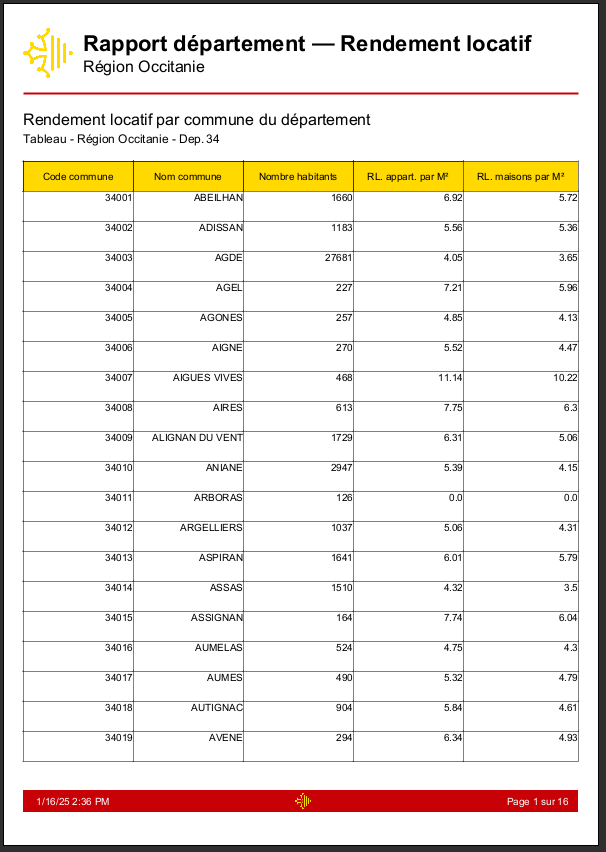
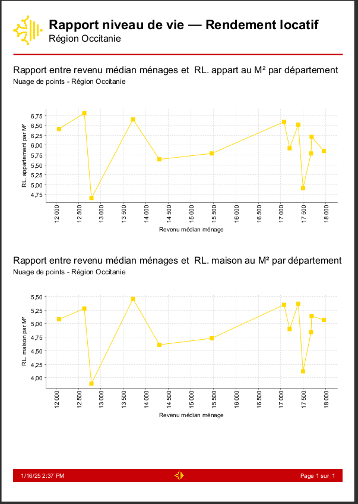
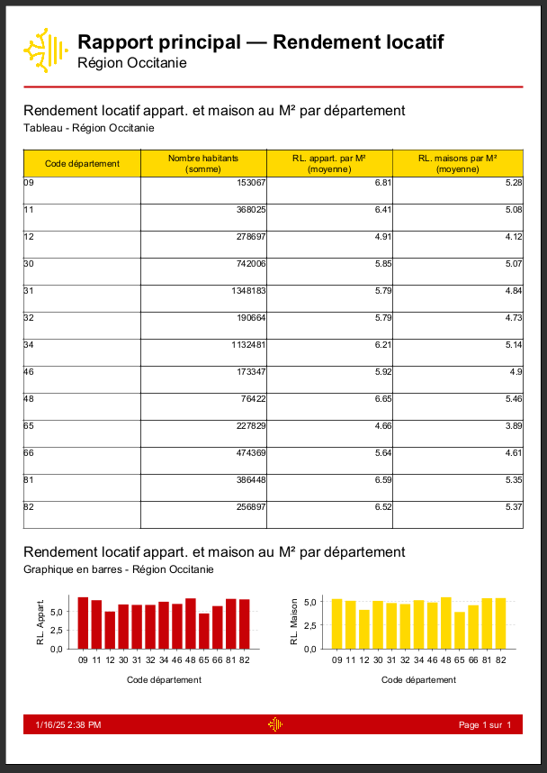

<div align="center">
  

[](https://github.com/Foufou-exe/occitanie-report-rental-yields/blob/main/LICENSE)
[]()
[]()
[]()
[]()
[]()
</div>

<div align="center">

[🇫🇷 French](./README.fr.md) | [🇬🇧 English](./README.md)

</div>


# 📊 JasperReports project: Analysis of rental yields in Occitania.

## 📌 Description

This project aims to provide a detailed and visual analysis of high rental yield areas in the Occitanie region. Using **Jaspersoft Studio** for reporting and technologies such as **Python** and **MySQL**, we created several reports allowing a real estate investor to identify the best investment opportunities.

## ⚡ Key features
- Data collection**: Extraction of open data (from [data.gouv.fr](https://www.data.gouv.fr)) on rents, purchase prices, demographics, and household incomes.
- Data cleansing and transformation**: Use of **Python** (with Pandas, Numpy and SQLAlchemy) to cleanse, transform and insert data into a **MySQL** database.
- Visual reporting**: Creating attractive, interactive reports in Jaspersoft Studio using graphs (bars, scatterplots, pie charts).
- Advanced analysis** :
  - Correlation between demographics and rental yields.
  - Comparison of household incomes with rental yields.

## 📁 Project structure

- **`/.settings`**: JasperReports configuration parameters.
- **`/images`**: Logos and images used in reports.
- **`/reports`** : JRXML files for Jasper reports.
- **`/reports/driver`** : JDBC drivers for MySQL.
- **`/reports/rendered`**: Reports generated in PDF format.
- **`/scripts`** : Python scripts for data cleansing and transformation.
- **`/sources/original`**: CSV/XLSX source files used for analysis and transformation.
- **`/sources/sql`** : SQL scripts for creating tables and inserting data.
- **`docker-compose.yml`** : Docker configuration file for MySQL and phpMyAdmin.


## 🛠️ Technologies used

### Reporting tools:
- **Jaspersoft Studio**: Creation of professional reports.

### Data collection and transformation:
- **Python**: Pandas, Numpy, SQLAlchemy.
- **Power Query**: Data profiling.

### Database:
- **MySQL**: Storage of cleansed data.
- **Docker**: Container management for MySQL and phpMyAdmin.


## 📊 Reports available

1. **Main report**: Summary view of rental yields by department.
2. **Zoom on communes**: Detailed analysis by commune within a département.
3. **Impact of demographics**: Correlation between demographics and rental yields.
4. **Rental yield vs household income**: Analysis of household income in relation to rental yield.


## 🚀 Installation and use

### Prerequisites

- Docker and Docker Compose installed.
- Jaspersoft Studio.
- Python 3.x with the following libraries: Pandas, Numpy, SQLAlchemy.

### Installation steps

1. Clone this repository :
   ```bash
   git clone https://github.com/Foufou-exe/occitanie-report-rental-yields.git
   ```
2. Configure and launch the Docker containers:
   ```bash
   docker-compose up -d
   ```
3. Run the Python scripts to clean up and insert the data into MySQL:
   ```bash
   cd scripts
   pip install -r requirements.txt
   python import-csv-to-sql.py
   ```
4. Launch Jaspersoft Studio.
5. Import the JRXML files + the MySQL JDBC connector `DataAdapterMySQL.jrdax` from **/reports`**.
6. Configure the connection to the MySQL database.
7. **Generate reports and view rental yields in Occitanie!


## 📖 Data sources

- **[Average price per m² of house and flat sales (2019)](https://www.data.gouv.fr/fr/datasets/prix-moyen-au-m2-des-ventes-de-maisons-et-dappartements-par-commune-en-2019/#/community-resources)**
- **[Requests for geolocalised property values](https://www.data.gouv.fr/fr/datasets/demandes-de-valeurs-foncieres-geolocalisees/)**
- **[Income of French people in the commune](https://www.data.gouv.fr/en/datasets/revenus-des-francais-a-la-commune/)**
- **[Rent map - Rent indicators](https://www.data.gouv.fr/fr/datasets/carte-des-loyers-indicateurs-de-loyers-dannonce-par-commune-en-2018/)**


## 🌟 Report generation

<details>
  <summary>
    📚 PDF - Demographics report - Rental yield.
  </summary>

[](./reports/rendered/report-demography-rental-yield.pdf)

</details>

<details>
  <summary>
    📚 PDF - Department report - Rental yield.
  </summary>

[](./reports/rendered/report-commune-rental-yield.pdf)

</details>

<details>
  <summary>
    📚 PDF - Standard of living - rental yield ratio.
  </summary>

[](./reports/rendered/report-life-level-rental-yield.pdf)


</details>

<details>
  <summary>
    📚 PDF - Main report - Rental yield.
  </summary>

[](./reports/rendered/report-main-rental-yield.pdf)


</details>

## Authors
- **Thibaut Maurras**
- **Akkhaladeth SOULISOMPHOU**

